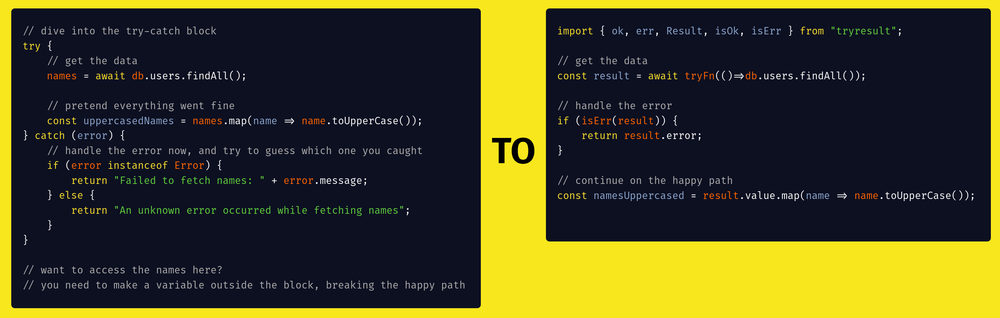

# 📛 TryResult

A tiny typescript library to get rid of try catches, and replace them with result types, inspired by Rust and Go error handling.



Under 650 bytes (minified and gzipped) and with no dependencies, TryResult only provides you with more elegant error handling and gives you functions that act as wrappers and catch errors in your own functions.

## Install

As with any package, install using your favorite package manager:

```sh
pnpm i tryresult
```

## Usage

The base functionality of TryResult revolves around the `Result` type, which can either be an `Ok` or an `Err`. You can create these results using the `ok` and `err` functions.

```ts
import { ok, err, Result, isOk, isErr } from "tryresult";

// You can create a Result with a value or an error

const success = ok("Success!"); // Result<string, Error>
const failure = err(new Error("Something went wrong")); // Result<string, Error>

// You can do typesafe checks of a Result

if (isOk(success)) {
  console.log(success.value); // "Success!"
}
if (isErr(failure)) {
  console.error(failure.error); // Error: Something went wrong
}
```

### Wrapping Functions

To do away with try-catch blocks around functions you can't control, you can use wrapping functions to automatically get a `Result` type.

```ts
import { tryFn, isErr } from "tryresult";

// Capture throws from async or sync functions

const result = tryFn(() => {
  return JSON.parse('{"message": "Hello!"}');
});

const asyncResult = await tryFn(async () => {
  const response = await fetch('https://api.example.com/data');
  return response.json();
});

// As shown above, the `Result` can be checked

if (isErr(result)) {
  console.error("An error occurred:", result.error); // Guaranteed to be an Error object
} else {
  console.log(result.value.message); // "Hello!"
}

```

### Working with Results

Several utilities are provided to make working with `Result` types easier, and abstract common functionality.

```ts
import { match, okOr, okOrThrow, mapOk, mapErr } from "tryresult";

// Match on the Result type to run different logic or return different values based on whether it's Ok or Err

const greeting = match(result, {
  ok: (value) => `Success: ${value.message}`,
  err: (error) => `Error: ${error.message}`,
});

// Ignore errors and use a default value for when you don't care about the error

const data = okOr(result, { message: "Default message" });

// If need be, you can throw an error if the Result is Err

try {
  const value = okOrThrow(result);
  console.log(value.message);
} catch (error) {
  console.error("Error was thrown:", error);
}

// Returned values can be transformed/mapped quickly

const uppercased = mapOk(result, (value) => value.toUpperCase());

// The same is true for errors, and several mapping functions are provided

const betterError = mapErr(result, (error) => `Custom error: ${error.message}`);
```

More information can be found as part of function documentation, which can be viewed in your editor or in the source code.