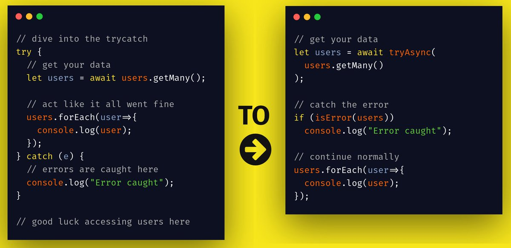

# 📛 TryResult

A typescript library to get rid of try catches, and replace them with result types, inspired by Rust and Go error handling.



Providing simple, easier, and more elegeant error handling, TryResult gives you functions that act as wrappers and catch errors in your own functions.

It also currently provides functions to assert if a result has an error in it, and to use a default value in case of errors.

<br>

## Install

As with any npm package:

```sh
npm i tryresult
```

Or use Yarn:

```sh
yarn add tryresult
```

<br>

## Usage

Import from the package:

```typescript
import { tryAsync, isError } from "tryresult";
```

Wrap your async function with `tryAsync`:

```typescript
let users = await tryAsync(
	// get a list of users from the database
	db.user.findMany(),
);
```

This will make the `users` variable be of type `T | Error`, meaning it can be either a value or an error (a union of types).

Then check for error in the variable with `isError`, and then handle the error:

```typescript
if (isError(users)) {
	return "Could not get users from db";
}
```

This is a type guard and all code after the `isError` will consider result's type to be `T`.

**[v1.2.x onwards]**

Let's say you're fetching something like a user's role from the db:

```typescript
const result = await tryAsync(db.user.find(id).role);
```

If you want to get the value and set a default value in case of error, you can use `okOr` on the result:

```typescript
const role = okOr(result, "guestUser");
```

Now `role` is gonna be either the value from the db, or if there was an error, `"guestUser"`.

<br>

To see the library used in a project, checkout out [ahmeddots/oswald](https://github.com/ahmeddots/oswald).
